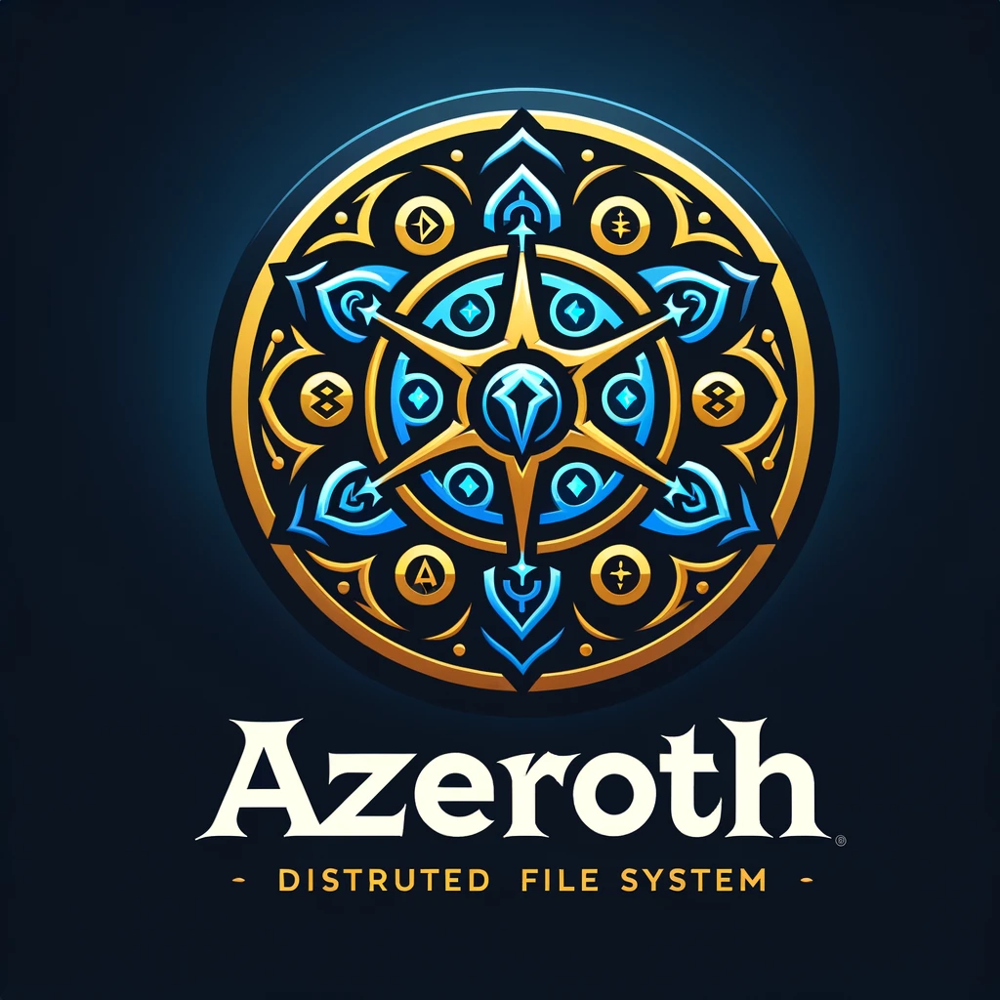

# Azeroth Nodes

Welcome to Azeroth Nodes, a distributed file system forged in the heart of Azeroth, powered by the robust and efficient
Rust language. Just as the Alliance and Horde work together (or sometimes at odds) to secure the safety and prosperity
of Azeroth, Azeroth Nodes aims to provide a resilient, scalable, and secure environment for storing and retrieving the
realm's most precious artifacts—your data.



## 📝 Documentation

If you want to get a little bit more of information about the documentation you can check the
[`documentation/`](https://github.com/Youngermaster/Azeroth-Nodes/tree/main/documentation) folder. We currently have:

- [Theoretical Framework](https://github.com/Youngermaster/Azeroth-Nodes/tree/main/documentation/TheoreticalFramework): This
  folder contains the theoretical framework of the project, where we based on the GFS and HDFS papers to create the base of the project. Just click or download the [main.pdf](https://github.com/Youngermaster/Azeroth-Nodes/blob/main/documentation/TheoreticalFramework/main.pdf) file.

## Overview

Azeroth Nodes is inspired by the vast, interconnected world of World of Warcraft, where heroes band together to face
challenges far greater than any could tackle alone. This project seeks to emulate that spirit of cooperation and
interconnectedness by creating a file system that is decentralized, fault-tolerant, and capable of scaling to meet the
needs of the modern data-driven world.

### Features

- **Guild Storage**: Collaborative spaces for your team to store, share, and manage data with the efficiency of a
  well-organized raid party.
- **Artifact Caching**: High-speed access to your most frequently used data, powered by the arcane energies of Azeroth.
- **Horde and Alliance Permissions**: Flexible, role-based access controls that ensure your data is guarded as fiercely
  as the gates of Orgrimmar or the walls of Stormwind.
- **Epic Quests for Data Recovery**: Advanced data recovery processes that make retrieving lost or corrupted data feel
  like completing an epic quest.
- **Scrolls of Insight (Documentation)**: Detailed guides and tomes to help you navigate the complexities of the Azeroth
  Nodes system, written by the wisest scribes of the land.

## Getting Started

Join us on this quest to revolutionize data storage. Whether you're a seasoned champion of the Horde or a noble defender
of the Alliance, your contributions are valuable to the Azeroth Nodes project.

### Installation

```bash
# Install the Azeroth Nodes CLI
cargo install azerothnodes
```

### Quick Start

Embark on your first quest with Azeroth Nodes by creating a new guild storage:

```rust
use azerothnodes::guild_storage;

fn main() {
let my_guild_storage = guild_storage::create("Fellowship of the Data");
println!("Your guild storage has been created, brave adventurer!");
}
```

## Contributing

The world of Azeroth is vast, and just as it takes a diverse array of heroes to protect it, it takes a diverse community
of developers to build Azeroth Nodes. Whether you wield the Hammer of Code Optimization or the Staff of Bug Squashing,
your skills are needed here.

- Fork the repository
- Create your feature branch (`git checkout -b feature/AwesomeFeature`)
- Commit your changes (`git commit -am 'Add some AwesomeFeature'`)
- Push to the branch (`git push origin feature/AwesomeFeature`)
- Open a Pull Request

## Lore and Easter Eggs

Stay vigilant! The world of Azeroth is filled with mysteries and secrets. Keep an eye out for hidden Easter eggs and
lore references scattered throughout the codebase. Can you find the lost artifacts of the Data Titans or decipher the
ancient algorithms inscribed within the Walls of Code?

---

We hope you enjoy exploring and contributing to Azeroth Nodes as much as we've enjoyed crafting this realm. Together, we
can build a distributed file system that stands as a testament to the resilience, innovation, and spirit of
collaboration that defines the world of Azeroth.

For the Horde! For the Alliance! For the future of data storage!
